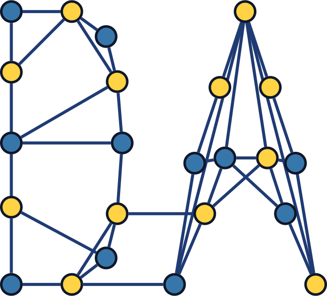

# Dapy Quickstart Guide

This guide helps you get started using dapy to simulate distributed algorithms in your Python project.



## Recommended: Start from the template

If you are starting a new project, use the template repository and follow its README:

- Template repo: https://github.com/xdefago/dapy-template
- Template README (setup, examples, and workflow): https://github.com/xdefago/dapy-template#readme

The template includes a ready-to-run project layout (with dapyview) and a working example.

## Installation

Since dapy is not yet published to PyPI, install it directly from GitHub:

```bash
# Using uv (recommended)
uv add dapy @ git+https://github.com/xdefago/dapy.git

# Using pip
pip install git+https://github.com/xdefago/dapy.git

# Using poetry
poetry add git+https://github.com/xdefago/dapy.git
```

**Requirements:** Python 3.13 or higher

## Basic Workflow

### 1. Define Your Algorithm

Create a Python file (e.g., `my_algorithm.py`):

```python
from dataclasses import dataclass, field
from dapy.core import (
    Algorithm, State, Event, Message, Signal,
    ProcessSet, ChannelSet, Channel, Pid
)
from typing import Sequence

# Define the state of each process
@dataclass(frozen=True)
class MyState(State):
    data: ProcessSet = field(default_factory=ProcessSet)
    # Add more fields as needed

# Define message types
@dataclass(frozen=True)
class MyMessage(Message):
    content: str = ""

# Define signal types
@dataclass(frozen=True)
class MySignal(Signal):
    pass

# Define the algorithm
@dataclass(frozen=True)
class MyAlgorithm(Algorithm[MyState]):
    """Your distributed algorithm implementation."""
    
    def initial_state(self, pid: Pid) -> MyState:
        """Create the initial state for a process."""
        return MyState(pid=pid)
    
    def on_event(self, old_state: MyState, event: Event) -> tuple[MyState, Sequence[Event]]:
        """Handle an event and return new state and events to schedule."""
        match event:
            case MyMessage(content=msg):
                # Process the message
                new_state = old_state.cloned_with(data=old_state.data + Pid(1))
                return new_state, []
            
            case MySignal():
                # Handle signal
                return old_state, []
            
            case _:
                raise NotImplementedError(f"Unknown event: {event}")
```

### 2. Create and Run a Simulation

Create a Python file to run your simulation (e.g., `run_simulation.py`):

```python
from dapy.core import Pid, System, Ring, Asynchronous, simtime
from dapy.sim import Simulator, Settings
from datetime import timedelta
from my_algorithm import MyAlgorithm, MySignal

# Set up the system
system = System(
    topology=Ring.of_size(4),      # 4 processes in a ring
    synchrony=Asynchronous(),       # Asynchronous model
)

# Create the algorithm
algorithm = MyAlgorithm(system)

# Configure simulation settings
settings = Settings(enable_trace=True)  # Enable trace collection

# Create and run the simulator
sim = Simulator.from_system(system, algorithm, settings=settings)
sim.start()

# Schedule initial events
sim.schedule(event=MySignal(target=Pid(0)), at=simtime())

# Run until no more events
sim.run_to_completion()

# Access the trace
for config in sim.trace.history:
    print(f"Time: {config.time}")
    print(f"Configuration: {config.configuration}")
```

### 3. Run Your Simulation

```bash
python run_simulation.py
```

## Key Concepts

### Algorithm[StateT]

Your algorithm must subclass `Algorithm` with a state type parameter:

```python
class MyAlgorithm(Algorithm[MyState]):
    ...
```

This ensures type safety - `old_state` in `on_event` will have type `MyState`.

### State

The state of each process must be a frozen dataclass:

```python
@dataclass(frozen=True)
class MyState(State):
    field1: str = ""
    field2: int = 0
```

States are immutable - use `cloned_with()` to create modified copies:

```python
new_state = old_state.cloned_with(field1="new_value")
```

### Events

Events are base class for inter-process communication:

- **Message** - Sent from one process to another
- **Signal** - Local event affecting a single process

All events have a `target` field. Messages additionally have a `sender` field.

### System

Defines the network topology and synchrony model:

```python
system = System(
    topology=Ring.of_size(4),        # or CompleteGraph, Star, Arbitrary
    synchrony=Asynchronous(),        # or Synchronous, PartiallySynchronous
)
```

### Simulator

Runs the simulation:

```python
sim = Simulator.from_system(system, algorithm, settings=Settings(enable_trace=True))
sim.start()                          # Initialize all processes
sim.schedule(...)                    # Schedule initial events
sim.run_to_completion()              # Run until no more events
```

Access results via `sim.trace`:

```python
for config in sim.trace.history:     # All configurations over time
    for event in sim.trace.events_list:  # All events
        ...
```

## Built-in Topologies

- `CompleteGraph.of_size(n)` - Every process knows all others
- `Ring.of_size(n)` - Processes arranged in a ring
- `Star.of_size(n, center)` - Star with central hub
- `Arbitrary(channels)` - Custom topology

## Built-in Synchrony Models

- `Synchronous()` - All processes move in lockstep
- `Asynchronous()` - No timing guarantees
- `PartiallySynchronous()` - Bounded message delays
- `StochasticExponential()` - Exponential random delays

## Serialization (Optional)

With the `json` extra installed:

```bash
pip install "dapy[json]"
```

Serialize traces to JSON:

```python
json_str = sim.trace.dump_json()
sim.trace = Trace.load_json(json_str)
```

## Examples

See the `examples/` directory for complete working examples:

- `examples/template.py` - Template for your own algorithm
- `examples/example.py` - Working example with Learn topology algorithm

## Documentation

- [Part 1: How to write an algorithm](docs/sample-algorithm.md)
- [Part 2: How to define an execution](docs/sample-execution.md)
- [Full API Documentation](https://xdefago.github.io/dapy/api)

## Need Help?

- Check the [API documentation](https://xdefago.github.io/dapy/api)
- Review the [examples](examples/)
- Read the [detailed tutorials](docs/)

Happy simulating!
